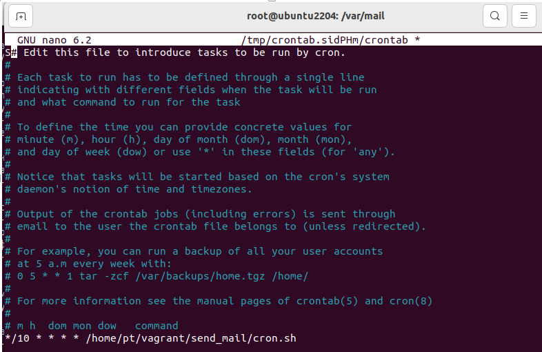
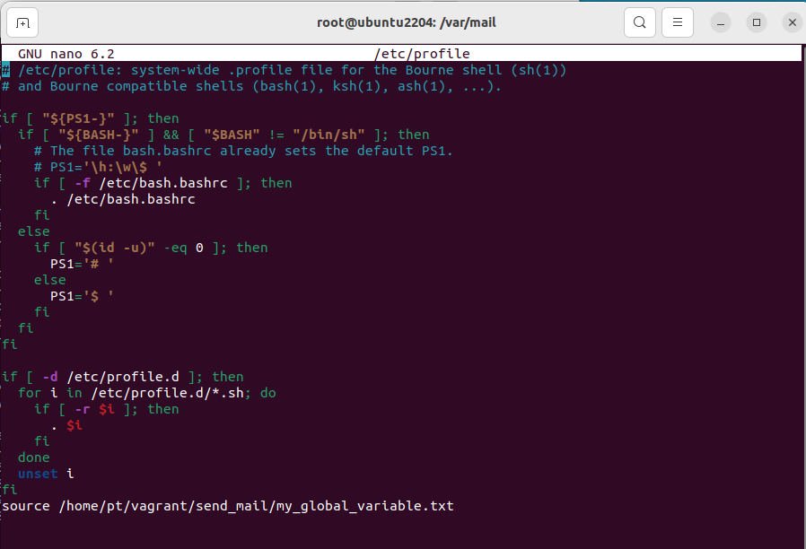
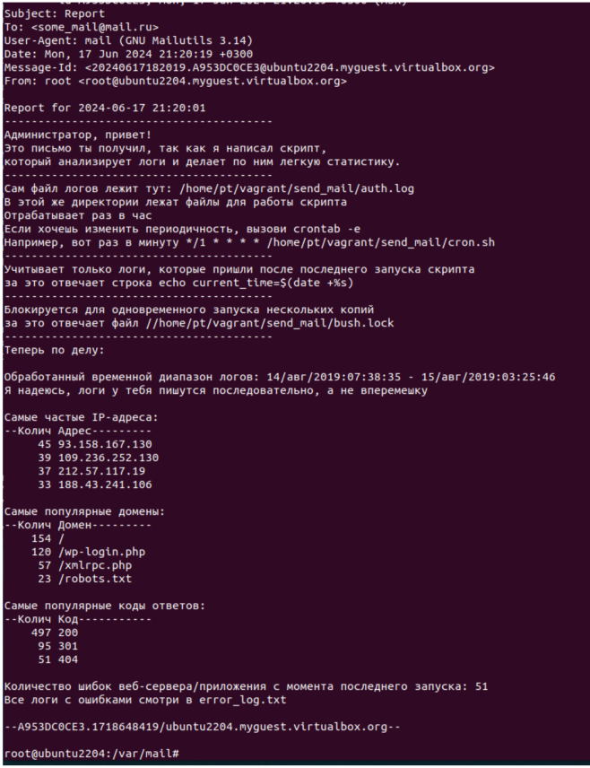

# homework-bush

Описание домашнего задания
---
1. Написать скрипт для CRON, который раз в час будет формировать письмо и отправлять на заданную почту.
Необходимая информация в письме:
- Список IP адресов (с наибольшим кол-вом запросов) с указанием кол-ва запросов c момента последнего запуска скрипта;
- Список запрашиваемых URL (с наибольшим кол-вом запросов) с указанием кол-ва запросов c момента последнего запуска скрипта;
- Ошибки веб-сервера/приложения c момента последнего запуска;
- Список всех кодов HTTP ответа с указанием их кол-ва с момента последнего запуска скрипта.
- Скрипт должен предотвращать одновременный запуск нескольких копий, до его завершения.

ОС для настройки: Ubuntu 24.04 

---

Установливаем cron

```bash
sudo apt-get install cron
```

Открываем файл crontab и добавляем строку, которая будет запускать скрипт по указанному пути (в моем скрине раз в 10 минут, это для отладки) 

```bash
crontab -e
0 * * * * /home/pt/vagrant/send_mail/cron.sh
``` 


Так же для функции блокировки одновременного запуска добавляем в файл /etc/profile строку

```bash
source /home/pt/vagrant/send_mail/my_global_variable.txt
```
Это позволит нам обращаться к переменной в этом файле и смотреть время прошлого запуска скрипта



---

Далее запускаем скрипт, в котором и происходит вся магия. 

Скрипт с подробными комментариями, находится в этом репозитории. 
```bash
Называется cron.sh
```

В системе он находится по указанному пути

Туда же надо положить файл с логами, либо изменить путь в скрипте

Доп файлы для работы скрипта тоже оставлю здесь, либо они сформируются при работе скрипта и нужных разрешениях для каталога

Пример работы скрипта, а именно формирования письма ниже на скрине (при обработке файла логов якобы впервые, то есть без учета даты логов)

Если хочется проверять скрипт несколько раз на одних и тех же логах, стоит закомментить строку и изменить значение на меньшее число

```bash
echo "current_time=$(date +"%s")" > /home/pt/vagrant/send_mail/my_global_variable.txt
# поставить в этом файле, например, current_time=1565746517
``` 
Текст письма для отправки на выбранную почту




